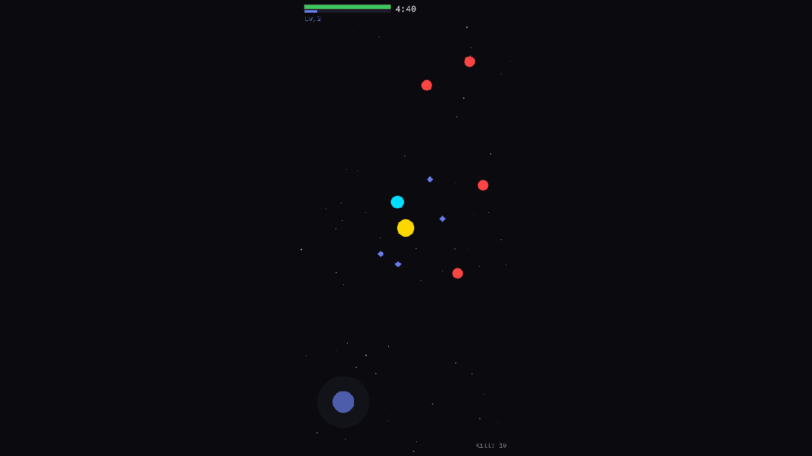

# 01. 프로젝트 셋업 & 코어 프로토타입

**날짜**: 2026-02-23
**상태**: 완료

## 작업 내용

Phaser 3 + Vite + TypeScript 기반으로 게임 프로젝트를 셋업하고,
핵심 게임플레이 프로토타입을 **단일 커밋**으로 구현했다.

## 기술 스택 선정

| 항목 | 선택 | 이유 |
|------|------|------|
| 엔진 | Phaser 3.90.0 | PMD 스프라이트(JSON+PNG atlas) 네이티브 지원 |
| 번들러 | Vite 6.4 | HMR 빠름, TypeScript 네이티브 |
| 언어 | TypeScript 5.7 | 타입 안전성 |
| 물리 | Phaser Arcade | 뱀서라이크에 충분한 간단한 2D 물리 |

## 구현된 기능 (Phase 1 통합)

1. **에이스 포켓몬** — 노란 원 (플레이스홀더), 화면 중앙
2. **가상 조이스틱** — 화면 좌하단, 터치/마우스 대응
3. **적 스폰** — 화면 가장자리에서 스폰, 플레이어 추적 AI
4. **자동 공격** — 가장 가까운 적에게 자동 투사체 발사
5. **HP/데미지** — 적 접촉 시 HP 감소, HP 0이면 사망 화면
6. **경험치** — 적 처치 → XP 보석 드랍 → 자석 효과로 수집
7. **레벨업** — XP 바 채우면 레벨업, 스탯 자동 강화
8. **동료 포켓몬** — Lv.2/4/6에서 자동 합류 (3가지 아키타입)
   - Projectile: 투사체 발사
   - Orbital: 에이스 주위 회전 + 접촉 데미지
   - Area: 주기적 광역 데미지
9. **5분 타이머** — 상단에 카운트다운
10. **별 배경** — 깜박이는 별 파티클 (우주 테마)
11. **사망 화면** — 통계 표시 + 탭하여 재시작

## 트러블슈팅

### 1. `this.make.graphics({ add: false })` TS 에러

**문제**: Phaser 3.90에서 `make.graphics()` 시그니처 변경.
`{ add: false }` 옵션이 `Options` 타입에 존재하지 않음.

**해결**: `this.add.graphics()`로 변경.
어차피 `generateTexture()` 후 즉시 `destroy()` 하므로 씬에 잠깐 추가되어도 문제 없음.

### 2. Vite 빌드 OOM (Out of Memory)

**문제**: `npx vite build` 실행 시 JavaScript heap out of memory.
Phaser 3이 ~1.5MB로 번들링되면서 기본 힙 사이즈 초과.

**해결**: `NODE_OPTIONS="--max-old-space-size=1024"` 환경변수 추가.
빌드 성공 (52초, 1,496KB).

### 3. 포트 충돌

**문제**: 다른 워크스페이스의 vite 서버가 이미 포트 3000 점유.
내 서버가 다른 포트에 뜨면서 잘못된 게임 화면 표시.

**해결**: `ps aux | grep vite`로 확인 후 기존 프로세스 kill, 재시작.

## 스크린샷

- 노란 원 = 에이스 (플레이어)
- 빨간 원 = 적 (추적 중)
- 청록 원 = 동료 (Lv.2에서 합류)
- 파란 다이아몬드 = XP 보석
- 좌하단 = 가상 조이스틱
- 상단 = HP + XP + 타이머 + 레벨

## 다음 작업

- [ ] 보스 스폰 & 보스전
- [ ] 사이클 전환 (보스 격파 → 군단 결성 → 새 에이스)
- [ ] 레벨업 선택 UI (현재는 자동 강화)
- [ ] 실제 PMD 스프라이트 적용
