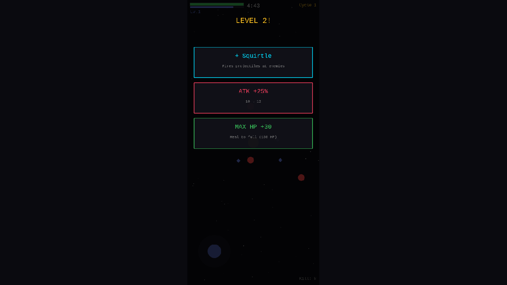
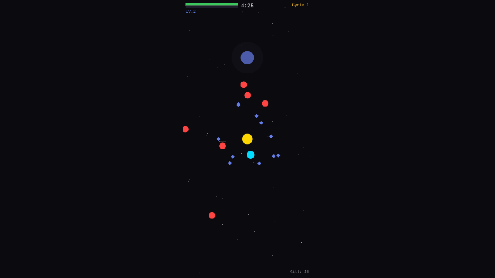

# 02. Boss System + Level-Up Selection + Cycle Transition

**Date**: 2026-02-23
**Phase**: 2 — Boss / Level-Up UI / Cycle System

---

## What was implemented

### 1. Level-Up Selection UI
- Replaced automatic stat boost with 3-choice card UI
- Choices include: new companion (if slot available), ATK +25%, MAX HP +30, or SPEED +20%
- Game pauses during selection, dimmed overlay with interactive cards
- Each card has color-coded border, label, and description
- Small passive stat boost (range + attack speed) still applies on every level-up

### 2. Boss System
- **Boss Warning** at 3:00 elapsed: flashing "WARNING!" text + red screen flash
- **Boss Spawn** at 4:00 elapsed: large magenta boss with HP scaled by cycle number
- **Boss HP Bar**: full-width bar at bottom of screen with "BOSS — Cycle N" label
- **Boss Death Detection**: `onEnemyDeath()` now checks if killed enemy is the boss
- Boss drops significantly more XP (50 + cycleNumber * 20)
- If timer runs out with boss alive, player is defeated

### 3. Cycle Transition
- **Cycle Clear Screen**: overlay showing stats (Level, Kills, Time, Legions)
- **Legion Formation**: current party (ace + companions) saved as a Legion
- **"NEXT CYCLE" button** with pulsing animation (also tap-anywhere after 2s)
- `startNextCycle()` increments cycle, destroys all entities, restarts scene with data

### 4. Cycle Persistence
- Added `init()` method to receive `cycleNumber` and `legions` across scene restarts
- `CyclePassData` and `LegionData` interfaces for type safety
- Death resets to Cycle 1 with empty legions

### 5. Cycle Scaling
- **Ace stats**: HP, ATK, speed, range, attack cooldown all scale with cycle number
- **Enemy stats**: HP, ATK, speed scale with both elapsed time AND cycle number
- **Boss HP**: 200 + cycleNumber * 80 (grows each cycle)
- **UI**: "Cycle N" displayed top-right, with legion count in brackets

---

## Screenshots

### Level-Up Selection UI

- 3 interactive choice cards with colored borders
- "LEVEL 2!" title, game paused during selection

### Gameplay with Companion

- After selecting Squirtle, cyan companion orbits around ace
- XP gems scattered, enemies approaching

### Boss Fight

- Large magenta boss circle on screen
- Boss HP bar at bottom: "BOSS — Cycle 1"
- Timer in red (0:53 remaining)
- Intense enemy swarm during boss phase

---

## Technical Notes

- TypeScript compilation: clean, no errors
- Vite build: successful (3m15s, 1503KB bundle)
- Exposed `game` to `window` for debugging convenience
- All boss-related state properly cleaned up on cycle transition and death

## Files Changed
- `src/scenes/GameScene.ts` — Boss system, level-up UI, cycle transition, scaling
- `src/main.ts` — Exposed game instance to window for debug

## Next Steps
- Phase 3: Legion system (auto-fighting past parties with LOD rendering)
- Phase 4: PMD sprite integration
