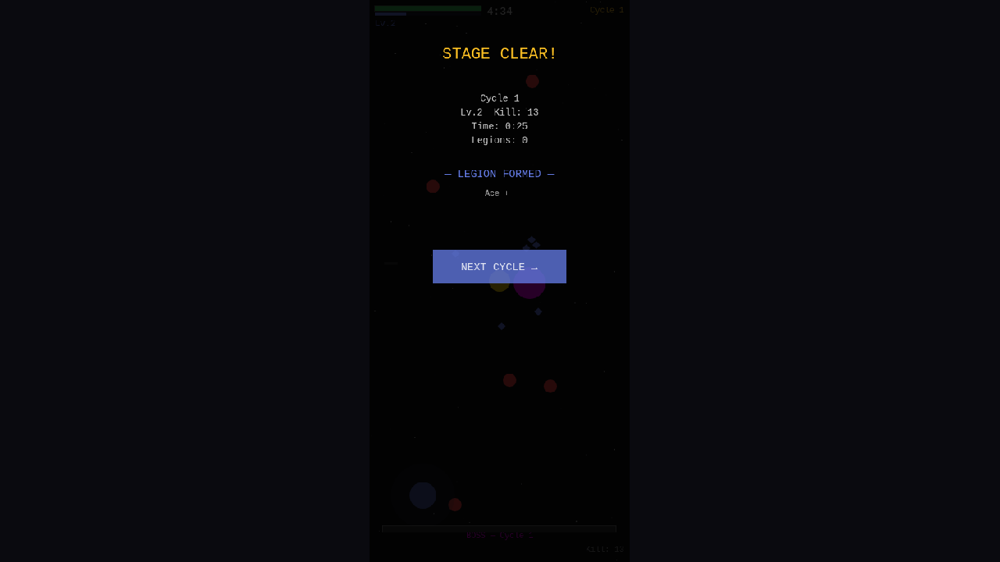
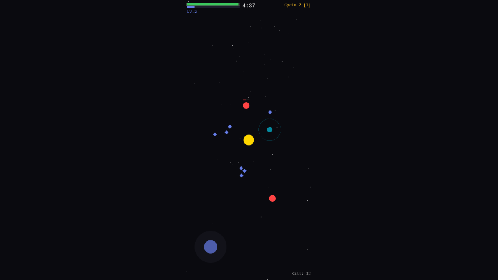

# 03. Legion System — Past Parties Auto-Fight

**Date**: 2026-02-23
**Phase**: 3 — Legion System + Infinite Scaling

---

## What was implemented

### Legion System
The core infinite-loop mechanic: when you clear a cycle (beat the boss), your current party (ace + companions) becomes a **Legion** — a semi-autonomous group that follows you into the next cycle and auto-attacks enemies.

#### LegionEntity Structure
- Each legion orbits around the ace at increasing distances
- **Tier 1 LOD** (first 3 legions): Individual circles for ace + companions + DPS aura ring
- **Tier 2+ LOD** (4th legion onward): Single glow blob for performance
- Auto-attacks: DPS-based damage to nearest enemy within range
- Attack interval scales inversely with legion DPS (stronger = faster)
- Visual: Color-coded per cycle, flash enemies on hit

#### Data Flow
```
Cycle 1 clear → LegionData saved (ace, companions, dps, color)
                       ↓
Cycle 2 init() → receives cycleNumber + legions via CyclePassData
                       ↓
createLegions() → spawns LegionEntity per LegionData
                       ↓
updateLegions() → orbit, render LOD, auto-attack enemies
```

### Cycle Scaling Refinements
- Ace base stats scale with `cycleMult = 1 + (cycleNumber - 1) * 0.15`
- Enemy stats scale with `cycleMult = 1 + (cycleNumber - 1) * 0.25`
- Boss HP: `200 + cycleNumber * 80`
- Speed scaling capped at 1.5x to prevent enemies from being too fast

---

## Screenshots

### Cycle Clear Screen

- "STAGE CLEAR!" with stats (Cycle 1, Lv.2, Kill: 13)
- "LEGION FORMED — Ace 1"
- "NEXT CYCLE →" button

### Cycle 2 with Legion

- "Cycle 2 [1]" in top-right showing 1 active legion
- Cyan circle with aura ring = Legion entity orbiting ace
- Legion auto-attacking nearby enemies
- Kill: 12 accumulating from both player and legion attacks

---

## Debugging Notes

### Challenge: Vite HMR vs scene.restart()
During testing, `scene.restart()` triggered Vite's HMR which caused full page reloads, destroying the `window.game` reference. This made it impossible to test cycle transitions via the dev server.

**Solution**: Used `vite build` + `python3 -m http.server` to serve static files without HMR interference. This allowed stable testing of the full cycle transition flow.

### Challenge: Boss Not Dying Before Timer
The ace's auto-attack range was too short to reach the boss before the timer expired. For testing, used `window.game.scene.scenes[1].onBossDefeated()` directly.

---

## Files Changed
- `src/scenes/GameScene.ts`
  - Added `LegionEntity` interface
  - Added `createLegions()` method
  - Added `updateLegions()` with LOD rendering + auto-attack
  - Cleanup in `startNextCycle()`
- `src/main.ts` — Exposed game to window (debug helper)

## Next Steps
- Phase 4: PMD sprite integration from pokemonAutoChess assets
- Performance testing with multiple legions
- More legion visual variety and attack patterns
