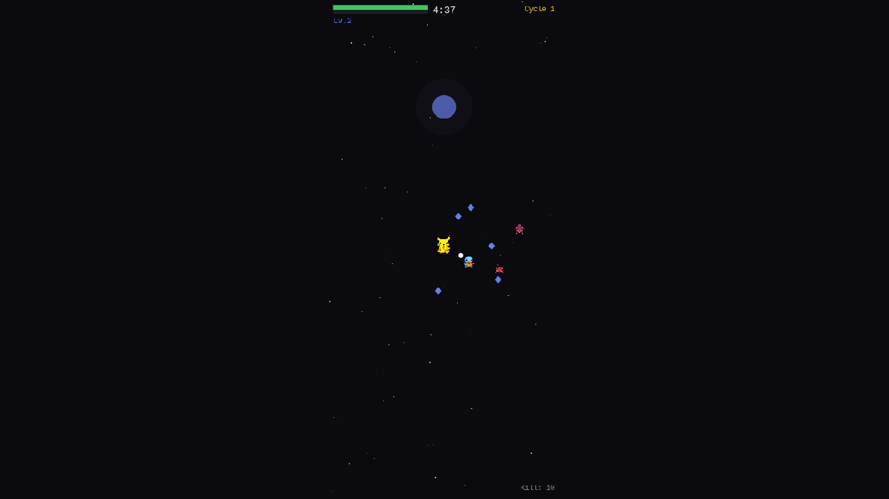
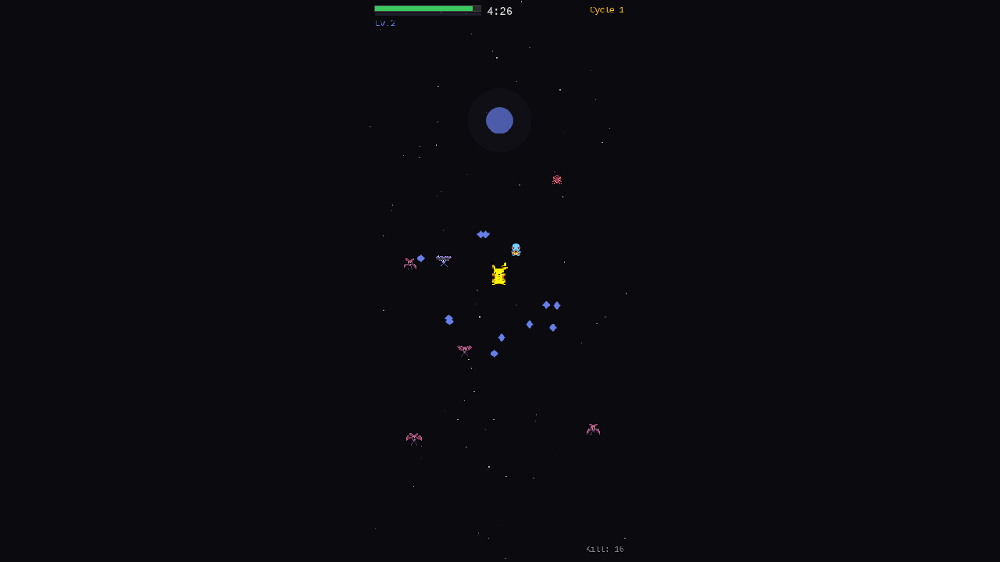
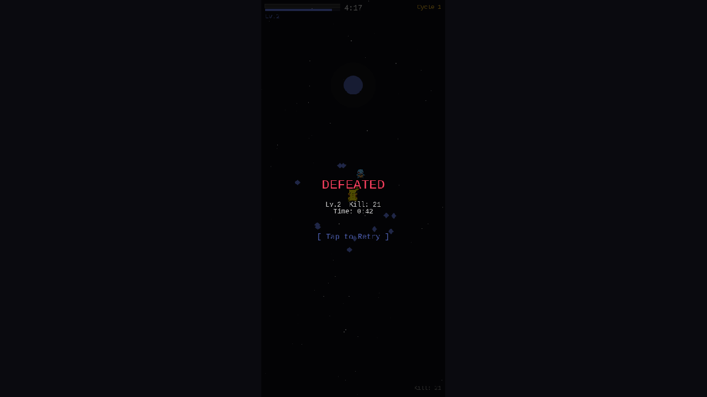

# 04. PMD Sprite Integration — Real Pokemon Graphics

**Date**: 2026-02-23
**Phase**: 4 — PMD Sprite Integration

---

## What was implemented

### PMD SpriteCollab Integration
Replaced all placeholder circle textures with actual Pokemon Mystery Dungeon (PMD) walk sprites from the [PMDCollab/SpriteCollab](https://github.com/PMDCollab/SpriteCollab) repository.

#### Sprite System (`PmdSpriteLoader.ts`)
- Loads Walk-Anim.png spritesheets from PMDCollab CDN
- 9 Pokemon configured with correct frame dimensions from AnimData.xml:
  - **Pikachu** (32×40, 4 frames) — Player ace
  - **Squirtle** (32×32, 4 frames) — Companion (projectile type)
  - **Gastly** (48×64, 4 frames) — Companion (orbital type)
  - **Geodude** (32×32, 4 frames) — Companion (area type)
  - **Rattata** (48×40, 4 frames) — Enemy tier 0
  - **Zubat** (32×56, 4 frames) — Enemy tier 0
  - **Pinsir** (32×48, 4 frames) — Boss
  - **Charmander** (32×32, 4 frames) — Reserved
  - **Bulbasaur** (40×40, 6 frames) — Reserved
- 8-directional walk animations created per Pokemon
- `getDirectionFromVelocity()` maps movement vector → sprite direction
- Graceful fallback: if CDN fails, placeholder circles used instead

#### Game Integration
- **Ace**: Pikachu at 1.5x scale, directional walk animation updates with joystick input
- **Enemies**: Random per tier from ENEMY_POOL, red tint (`0xff8888`) to distinguish from allies
- **Companions**: From COMPANION_POOL (Squirtle/Gastly/Geodude), 1.2x scale
- **Boss**: Pinsir at 2.0x scale
- **Portraits**: Normal.png loaded for each Pokemon (future UI use)

#### Loading Strategy
- `BootScene.preload()` triggers async sprite loading with `maxParallelDownloads: 4`
- `loaderror` handler logs warnings and falls through to placeholders
- Loading progress text shown during sprite downloads
- `BootScene.create()` generates walk animations after load completes

---

## Screenshots

### PMD Sprites in Gameplay

- Pikachu (yellow, center) as player ace — PMD Walk sprite
- Squirtle (blue, nearby) as companion — PMD Walk sprite
- Zubat enemies (pink tint) approaching from edges
- XP gems, projectiles, and kill counter visible

### Battle Scene

- Multiple enemy types visible: Zubat, Rattata, Gastly
- Red-tinted enemies clearly distinguishable from allied sprites
- Squirtle companion firing projectiles
- Pikachu directional sprite facing movement direction

### Defeat Screen

- "DEFEATED" at Lv.2, Kill: 21, Time: 0:42
- PMD sprites visible even in game-over state
- "Tap to Retry" prompt

---

## Debugging Notes

### Challenge: Frame Dimension Mismatch
Initial implementation used hardcoded frame sizes that didn't match the actual sprite sheets. Phaser showed "Texture has no frame" warnings and sprites rendered incorrectly.

**Solution**: Fetched each Pokemon's `AnimData.xml` from the SpriteCollab repo to extract actual `<FrameWidth>` and `<FrameHeight>` values. Each Pokemon has different frame dimensions (e.g., Gastly is 48×64, Pikachu is 32×40, Bulbasaur is 40×40).

### Challenge: External CDN Loading Speed
PMD sprites are loaded from `raw.githubusercontent.com` which can take 30-60+ seconds in headless browsers. This caused screenshots to sometimes show placeholder sprites.

**Solution**: Added explicit loading progress UI, increased wait times during testing, and ensured the `loaderror` handler gracefully falls back to placeholders.

### Challenge: Port Conflicts with Other Projects
Another project (poke-roguelite) was running on ports 3000-3001, causing browser sessions to mix between projects.

**Solution**: Assigned **port 4000** as the dedicated port for poke-survivor. Killed all processes on ports 3000-3010 before testing.

### Challenge: Playwright Session Leaks
Browser sessions from `playwright-cli` would sometimes navigate to the wrong localhost port or lose connection to the game server.

**Solution**: Used named sessions (`-s=pokesurvivor`), closed all sessions before reopening, and verified page URL after navigation.

---

## Files Changed
- **NEW** `src/sprites/PmdSpriteLoader.ts` — PMD sprite loader, animation creator, direction mapper
- `src/scenes/BootScene.ts` — Added PMD sprite/portrait loading + animation creation
- `src/scenes/GameScene.ts`
  - Added `pokemonKey` to `AceData` and `EnemyData` interfaces
  - Updated `createAce()` for PMD Pikachu sprite
  - Updated `updateAceMovement()` for directional animation
  - Added `ENEMY_POOL` and `COMPANION_POOL` static arrays
  - Updated `spawnEnemy()`, `addCompanion()`, `spawnBoss()` for PMD sprites

## Next Steps
- Performance optimization for sprite-heavy scenes
- More Pokemon variety (expand roster beyond 9)
- Portrait integration in level-up UI
- Sound effects and BGM
