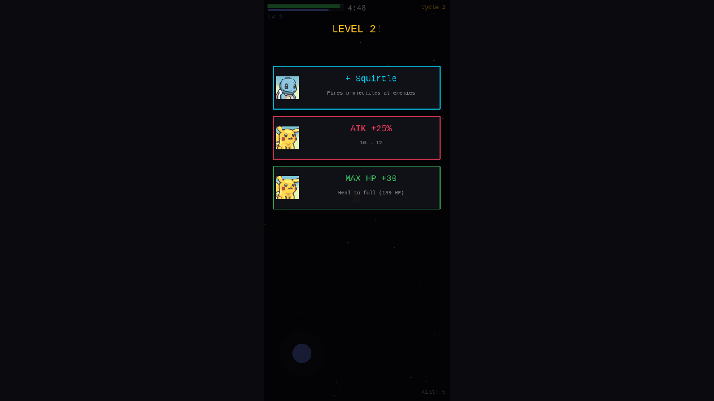
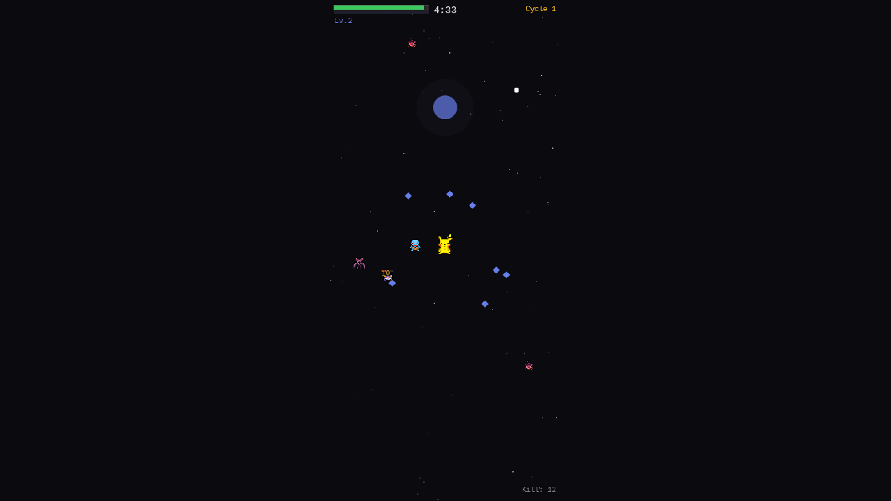
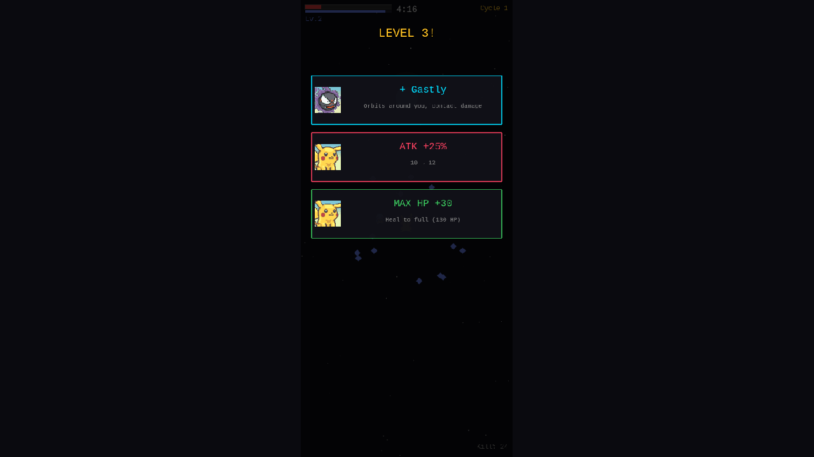

# 05. UI Polish — Portraits, Damage Popups, Roster Expansion

**Date**: 2026-02-23
**Phase**: 5 — Visual Polish & UI Enhancement

---

## What was implemented

### Pokemon Portraits in Level-Up UI
Added PMD portrait images (Normal.png from SpriteCollab) to the level-up selection cards. Each card now shows the relevant Pokemon's face on the left side:
- **Companion cards**: Show the companion being offered (Squirtle, Gastly, Geodude, Charmander, Bulbasaur)
- **Stat boost cards**: Show the ace's portrait (Pikachu)
- Portraits loaded from PMDCollab CDN at 48×48 display size
- Graceful fallback: cards display normally without portraits if images fail to load

### Damage Number Popups
Floating damage numbers now appear whenever damage is dealt:
- **Yellow (#fbbf24)**: Projectile hits (ace + companion projectiles)
- **Purple (#c084fc)**: Orbital companion damage
- **Green (#4ade80)**: Area-of-effect companion damage
- **Cyan (#67e8f9)**: Legion auto-attack damage
- **Red (#f43f5e)**: Player taking damage

Implementation uses an **object pool** (max 30 texts) to avoid GC pressure. Numbers float upward and fade out over 600ms. Damage below 0.5 is filtered to avoid spam from per-frame contact damage.

### Roster Expansion
Expanded the Pokemon pool to use all 9 configured sprites more actively:

**Enemy Pool**:
- Tier 0 (early): Rattata, Zubat
- Tier 1 (mid): Geodude, Gastly, **Bulbasaur** (new)
- Tier 2 (elite): Pinsir, **Charmander** (new)

**Companion Pool** (max increased from 3 → 5):
1. Squirtle (projectile)
2. Gastly (orbital)
3. Geodude (area)
4. **Charmander** (projectile) — new
5. **Bulbasaur** (area) — new

### Hit Feedback Improvement
Enemy sprites now properly maintain their red tint after being hit:
- Previously: `clearTint()` after flash removed the enemy-identifying red tint
- Now: Restores `setTint(0xff8888)` after hit flash, keeping enemies visually distinct

---

## Screenshots

### Level-Up UI with Portraits (Level 2)

- Squirtle portrait on "+Squirtle" companion card
- Pikachu portrait on "ATK +25%" and "MAX HP +30" stat cards
- Clean card layout with portrait on left, text centered-right

### Damage Popups in Battle

- Yellow "10" damage number floating above hit enemy
- Pikachu ace + Squirtle companion in battle
- Multiple Zubat enemies with red tint
- XP gems scattered from defeated enemies

### Level 3 — Gastly Companion Offer

- Gastly portrait on "+Gastly" orbital companion card
- HP bar in critical (red) state
- Different portrait per companion type demonstrates dynamic UI

---

## Debugging Notes

### Challenge: Playwright Session Leaking to Other Project
Browser sessions kept navigating to port 3001 (the 1호기's Poke Roguelite project on the same EC2). Screenshots showed the wrong game's title screen.

**Solution**: Used dedicated named sessions (`-s=pksv`) and explicitly killed processes on ports 3000-3010 before testing. Verified page title via `eval "document.title"` before taking screenshots.

### Challenge: Tint Reset After Hit
After projectile hit flash, `clearTint()` was removing the enemy-identifying red tint (0xff8888), making enemies look like allies.

**Solution**: Changed all hit-flash recovery callbacks from `clearTint()` to `setTint(0xff8888)` to restore the red enemy tint after the white/purple flash.

---

## Files Changed
- `src/scenes/GameScene.ts`
  - Added `showDamagePopup()` with text object pool
  - Added damage popups to all hit callbacks (projectile, orbital, area, legion, ace)
  - Added portrait images to level-up selection cards
  - Expanded ENEMY_POOL: Bulbasaur (tier 1), Charmander (tier 2)
  - Expanded COMPANION_POOL: Charmander (projectile), Bulbasaur (area)
  - Max companions: 3 → 5
  - Fixed tint recovery after hit flash

## Next Steps
- Title screen / start menu
- Sound effects and BGM
- Performance optimization for 5+ companions + legions
- More Pokemon variety beyond 9
