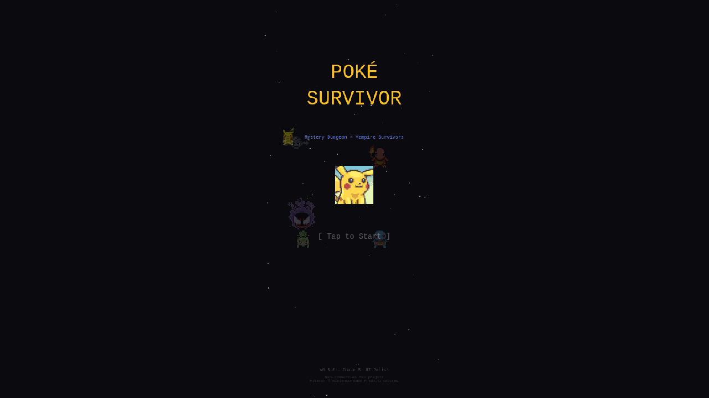

# 06. Title Screen + Sound Effects

**Date**: 2026-02-23
**Phase**: 6 — Title Screen & SFX

---

## What was implemented

### Title Screen (`TitleScene.ts`)
A proper start screen that gives the game identity before jumping into gameplay:

- **"POKÉ SURVIVOR"** large gold title text with stroke
- **"Mystery Dungeon × Vampire Survivors"** subtitle in accent blue
- **Pikachu portrait** as mascot, gently bobbing up and down
- **Floating Pokemon sprites** in background (semi-transparent, animated walk sprites)
- **Starfield** animated background (same system as GameScene)
- **"[ Tap to Start ]"** blinking prompt
- **Version tag**: "v0.5.0 — Phase 5: UI Polish"
- **Copyright notice**: "Non-commercial fan project / Pokemon © Nintendo/Game Freak/Creatures"

Flow: BootScene → TitleScene → (tap) → fade out → GameScene
Death: GameScene → (tap) → TitleScene (no longer restarts directly)

### Procedural 8-bit Sound Effects (`SfxManager.ts`)
All sound effects generated programmatically via Web Audio API — no external audio files needed:

| SFX | Trigger | Description |
|-----|---------|-------------|
| `playHit()` | Projectile hits enemy | Quick descending square wave blip |
| `playPickup()` | XP gem collected | Rising sine wave chirp |
| `playLevelUp()` | Level up | C-E-G-C ascending square wave arpeggio |
| `playDeath()` | Player dies | Descending sawtooth wave |
| `playBossWarning()` | 3:00 mark | Three alternating square wave honks |
| `playStageClear()` | Boss defeated | 7-note ascending victory fanfare |
| `playStart()` | Tap to start | Rising square wave blip |

Audio context initialized on first user gesture (tap to start) to comply with browser autoplay policies.

---

## Screenshots

### Title Screen

- Gold "POKÉ SURVIVOR" title
- Pikachu portrait mascot (center)
- Floating Pokemon sprites in background (Gastly, Charmander, Squirtle, etc.)
- "[ Tap to Start ]" blinking prompt
- Copyright notice at bottom

---

## Debugging Notes

### Challenge: EC2 Memory Exhaustion
With only 914MB total RAM and two Claude instances running (1호기 + 2호기), Chrome/Playwright kept crashing or timing out. Phaser's 1.5MB bundle + WebGL initialization in headless mode was too heavy.

**Solution**:
- Killed all stale Chrome/Playwright processes between attempts
- Used `run-code` with `waitUntil: "commit"` instead of default `domcontentloaded`
- Added 50-second wait after page commit for Phaser + external sprite loading
- Extended screenshot timeout to 30 seconds

### Challenge: Playwright Session Leaks
Browser sessions kept redirecting to port 3001 (the other project). Named sessions (`-s=pksv`) and socket cleanup helped but didn't fully solve it.

**Root cause**: Playwright daemon persists between calls and the other project's Vite dev server was sometimes responding first. Using `run-code` with explicit `page.goto()` inside the callback gave us full control over navigation.

---

## Files Changed
- **NEW** `src/scenes/TitleScene.ts` — Title screen with animated background, mascot, and tap-to-start
- **NEW** `src/audio/SfxManager.ts` — Procedural 8-bit sound effects via Web Audio API
- `src/main.ts` — Added TitleScene to scene list
- `src/scenes/BootScene.ts` — Boot → TitleScene (was: Boot → GameScene)
- `src/scenes/GameScene.ts` — Added sfx calls (hit, pickup, levelup, death, boss, clear); death → TitleScene
- `src/config.ts` — MAX_COMPANIONS: 3 → 5

## Next Steps
- Background music (simple loop)
- More visual effects (screen shake, particle explosions)
- Performance optimization
- Expand Pokemon roster further
