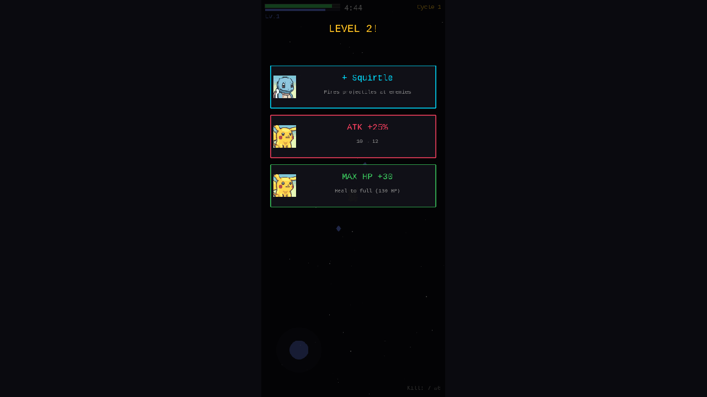
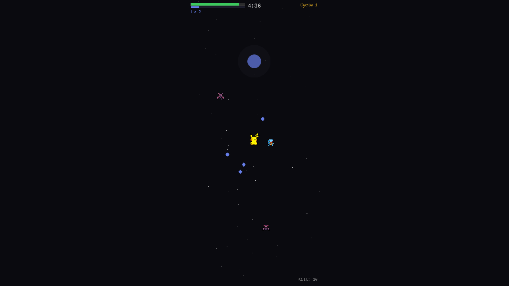

# 07. Game Juice — Particles, Screen Shake, Kill Streaks

**Date**: 2026-02-23
**Phase**: 7 — Game Feel / Juice

---

## What was implemented

### Death Particles
When enemies die, colored particles burst outward:
- **Normal enemies**: 5 small red particles, spread 40-100px
- **Boss**: 12 larger gold particles, spread 40-140px
- Particles fade and shrink over 300-500ms

### Camera Effects
- **Screen shake** on boss kill (300ms, intensity 0.015)
- **Micro shake** during kill streaks of 5+ (50ms, intensity 0.003)
- **White flash** on level up (200ms)

### Kill Streak System
Consecutive kills within 2 seconds build a streak counter:
- **5+ kills**: Fire emoji shows in kill counter (`Kill: 15 🔥8`)
- **10+ kills**: Kill text turns gold
- **10, 15, 20, 25+ kills**: Big floating combo text:
  - "COMBO x10!" (blue)
  - "COMBO x15!" (gold)
  - "RAMPAGE x20!" (red)
  - "MASSACRE x25!" (red)
- Streak resets after 2 seconds without a kill

### XP Magnet Scaling
- Magnet range now grows with level: `60 + level * 5` (was: fixed 60)
- Magnet speed also increases: `200 + level * 10` (was: fixed 200)
- Makes XP collection smoother at higher levels

---

## Screenshots

### Level-Up with Kill Streak

- "Kill: 7 🔥6" showing active kill streak
- Level 2 selection with portraits
- Camera flash effect active (white tint on screen edges)

### Battle Scene

- Pikachu ace + Squirtle companion in combat
- Multiple Zubat enemies with red tint
- Kill: 10, Lv.2
- Death particles are momentary (hard to capture in static screenshot)

---

## Files Changed
- `src/scenes/GameScene.ts`
  - Added `killStreak`, `lastKillTime` state variables
  - Added `updateKillStreak()` — resets after 2s gap
  - Added `showStreakText()` — floating combo text at milestones
  - Added `spawnDeathParticles()` — burst circles on enemy death
  - Camera shake on boss kill and during streaks
  - Camera flash on level up
  - Kill counter shows streak emoji when 5+
  - XP magnet range/speed scales with level

## Next Steps
- Background music (simple loop)
- More visual effects (enemy spawn animation)
- Performance optimization for many entities
